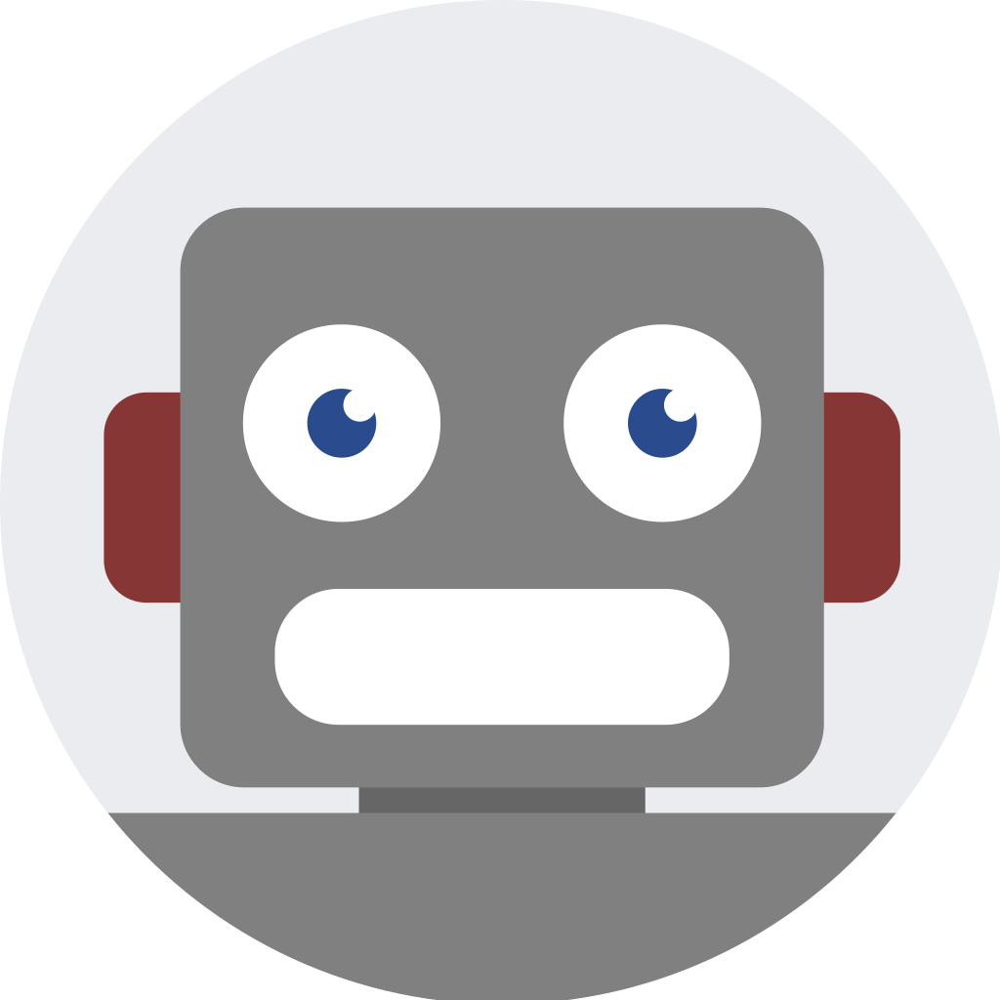

<!-- header -->

    

    <!-- Header -->
        
        <h2>BestBot</h2>
        
<i>Get a GPU!</i>

    

    

    <!-- Shields -->
        
        
        
        
        
        
    

    

    <!-- Links -->
        <a href="#demo">View Demo</a>
        ·
        <a href="https://github.com/armckinney/bestbot/issues/new/choose">Report Bug</a>
        ·
        <a href="https://github.com/armckinney/bestbot/issues/new/choose">Request Feature</a>
    

 
 

<!-- Description -->
A hastily written Webscan Bot that notifies when a product is in stock on a webstore.

### Quick Start

1. ##### Setup & Configure the project:
A sample configuration is provided at `/config/config.example.json`. This file should be updated to desired configuration and renamed to `/config/config.json`.

2. ##### Start a Docker Container:
Start an associated container built from the `./.devcontainer/Dockerfile` in this project.
The container can be started after being built via the `docker start <container_name>` command.

3. ##### Start the Script:
Start the application by executing the script with python inside of the container, as such: `docker exec -it <container_name> poetry run python bestbot.py`. Note that poetry is the virtual environment that the script runs in.

### Usage

##### Logs:
Logs can be viewed in runtime via executing the `rlog.py` script, which follows the stdout output from the bestbot script. `docker exec -it <container_name> poetry run python rlog.py`.

Alternatively logs can be printed via executing the `plog.py` script, which simply prints their contents. `docker exec -it <container_name> poetry run python plog.py`.

##### Configuration:
Changing the product watch configuration can be completed by modifying the config file (`/config/config.json`).